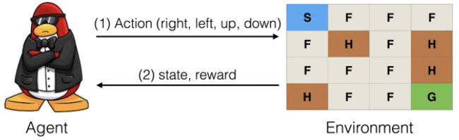

# Playing OpenAI GYM Games

> Reinforcement Learning with TensorFlow & Open AI GYM


### Frozen Lake


### Frozen Lake World (OpenAI GYM)



- Agent: 움직이는 대상
- state: 움직일 때 +1씩 증가
- reward: 보상


```python
import gym
env = gym.make("Taxi-v1")
observation = env.reset()
for _ in range(1000) :
    env.render()
    action = env.action_space.sample()
    observation, reward, done, info = env.step(action)
```


```python
import sys
sys.path.append('c:\python38\lib\site-packages')
import gym

env = gym.make("FrozenLake-v0")
observation = env.reset()
for _ in range(1000):
    env.render()
    action = env.action_space.sample()
    observation, reward, done, info = env.step(action)
```


## LAB


