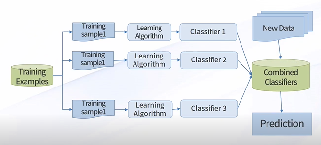
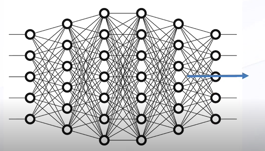
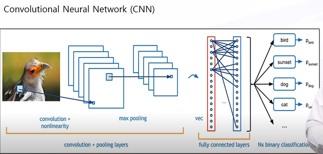
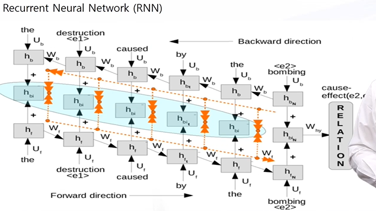

# 텐서플로우딥러닝_Deep Learning

## Tensorboard

### 앙상블

#### 1) Ensemble

다중 모델 결합(combining multiple models), 분류기 조합(classifier combination)

- 배깅(bagging: bootstrap aggregating) - Breiman(1996)
- 부스팅(boosting) - Adaboos(adaptive boosting)
- 랜덤 포레스트(random forest: 무작위 추출 randomization)
- 스태킹(stacking: stacked generalization)

#### 2) bagging

- 배깅: 주어진 자료에서 여러 개의 붓스트랩(bootstrap)을 생성하고, 각 붓스트랩 자료에 예측보형을 만든 후, 결합하여 최종 예측모형을 만드는 방법
- 붓스트랩(bootstrap) - 주어진 자료에서 동일한 크기의 표본을 랜덤 복원추출로 뽑은 자료
- 보팅(voting) - 여러 개의 모형으로부터 산출된 결과를 다수결에 의해서 최종 결과를 선정하는 과정
  - 최적의 의사결정나무를 구축할 때 가장 어려운 부분이 가지치기( pruning)이지만 배깅에서는 가지치기를 하지 않고, 최대로 성장한 의사결정나무들을 활용
  - 훈련자료의 모집단의 분포를 모르기 때문에 실제 문제에서는 평균예측모형을 구할 수 없음. 배깅은 훈련자료를 모집단으로 생각하고 평균예측모형을 구한 것과 같아 분산을 줄이고 예측력을 향상시킬 수 있음
  - 일반적으로 과대적합된 모형, 편의가 작고 분산이 큰 모형에 사용하는 것이 적합

### Deep Neural Network 의 형태

#### 1) Feedforward neural network

뒤에서부터 입력되는 것들부터 hidden layer들 계속 앞으로 붙임

#### 2) Fast forward

두 칸 단위로 띄워서 학습을 시킴

ResNet(Residual Network)

- 마이크로 소프트팀의 팀에서 개발
- 스킵 연결(skip connection) 도입
- 이미지넷에서 오류율 3.5%의 결과

#### 3) Split & Merge

#### 4) Recurrent network

