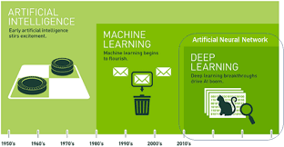
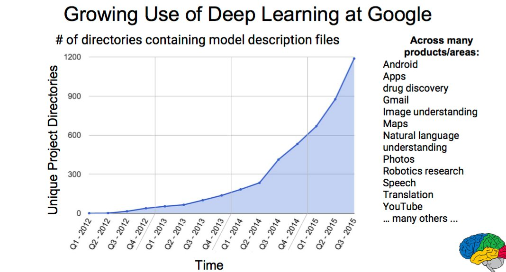

# 텐서플로우딥러닝_Deep Learning

## 1장 딥러닝 개념과 활용

- 딥러닝과 머신 러닝에 대한 관심(google trend)

  우리나라의 경우 딥러닝에 대한 관심이 많은 반면 전세계는 머신러닝에 더욱 관심이 많은 경향

  => 우리나라와 전세계의 딥러닝/머신러닝 시장이 다르다.

> 머신러닝과 딥러닝이 무엇일까?

#### 1.1 머신러닝

- 컴퓨터 프로래밍, test 및 자격을 클래스로 나누어서 그 클래스를 컴퓨터가 배울 수 있는 것.
- 특정한 매개변수 설정을 통해 컴퓨터가 더욱 더 효율적으로 해결할수있도록 함
- 머신러닝 활용 분야: 기업의 신용 평가 모델, 태풍 이동 경로 예상 모형

#### 1.2 딥러닝

- 머신러닝의 한 분야
- 기계가 학습을 해서 그 문제를 해결하는 것은 머신러닝과 똑같은 방식으로 이루어지지만 이를 학습하는 방식이 다름
- 작은 단위의 컨셉을 계층적인 구조로 구성시켜놓고 제일 마지막 단계에서 대표성을 가진 결과물을 도출해 냄.

### 머신 러닝과 딥 러닝의 관계

- 1980년대 부터 의사결정나무, SVM 등 스스로 학습할 수 있는 머신러닝 분야가 꽃을 피게 됨
- 연구하는 분야마다 적절한 알고리즘을 사용해서 해결하도록 발전할 수 있음
- 뉴럴네트워크의 퍼셉트론에서 점점 발전해서 만들어진 개념이 딥러닝
- 딥러닝이 AI의 꽃을 피우게 됨

### 머신러닝과 딥 러닝의 비교

#### 2.1 데이터 의존도

- 딥러닝과 전통적인 머신러닝의 가장 큰 차이점은 데이터 양에 따른 성능
- 딥러닝 알고리즘은 어떤 과제를 이해하기 위해서 매우 큰 데이터가 필요하기 때문에 데이터가 작을 땐느 성능이 잘 나오지 않으나 데이터 양이 커지면 성능을 계속 향상 시킬 수 있음.

- 분석하고자 하는 목적과 데이터의 양에 따라서 딥러닝 머신러닝을 사용해야함.

#### 2.2 하드웨어 의존도(Hardware dependencies)

- 딥러닝 알고리즘은 고사양 머신이 많은 부분을 좌지우지 됨

- 머신러닝은 저사양 머신에서도 실행이 가능

- 딥러닝 알고리즘의 요구사항은 GPU가 포함되기 때문이고, GPU는 작업에서 숫자계산을 담당함.

- 딥러닝은 많은 양의 행렬곱셈을 수행해야 하기 때문에 GPU를 사용하면 보다 효율적으로 최적화 할 수 있음

  > GPU :  그래픽 처리 장치, 그래픽 카드에서 계산하는 속도

#### 2.3 Feature Engineering

- Feature engineering 은 데이터 복잡성을 줄이고, 학습 알고리즘에서 패턴을 보다 잘 보이게 하는 과정

- 이 과정은 많은 시간과 전문가가 필요하다는 점에서 어렵고 비쌈.

- 머신러닝은 대부분의 적용된 변수(feature)는 전문가가 식별한 다음 정보 영역 및 데이터 유형별로 코딩함.

  예) 신용평가 모형 개발에서 사용되는 50여개의 변수 중 비즈니스 여건이나 금융당국에 의해 제거되어야 하는 변수(학력, 성별 등)가 있을 수 있기 때문에 전문가가 직접 확인하고 걸러내는 작업이 필요

- 딥러닝은 high-level features를 학습하며 모든 과제에서 새로운 변수 추출이라는 작업을 줄여줌

- Convolutional Neural Network의 경우, 초기 layer에서는 이미지의 edge나 line 같은 low-level features를 학습하고 그 다음 이미지의 high-level 표현을 학습함.

#### 2.4 문제 해결 접근법(problem solving approach)

- 전통적인 머신러닝 알고리즘으로 문제를 해결할 때는 주로 문제를 여러 개의 파트로 나눈 후, 각각에 대한 답을 구하고 그 결과를 합치는 방법을 추천
- 딥러닝은 end-to-end 방식으로 문제를 해결

> 사물인지 프로젝트의 경우,

- 머신러닝 접근 방법
  1. 사물 탐색: grabcut과 같은 경계탐지 알고리즘(bound box detection algorithm)을 사용하여 이미지를 훑어보고 가능한 모든 객체를 추출
  2. 사물인지: 모든 객체들을 SVM과 같은 객체 인식 알고리즘으로 관련 객체를 인식함
- 딥러닝 접근 방법
  1. end-to-end 방식인 YOLO net에서 이미지를 전달하면 객체의 이름과 위치가 표시 됨.

#### 2.5 실행 시간(Execution time)

- 딥 러닝 알고리즘은 훈련 시간이 굉장히 오래 걸림
- 딥 러닝 알고리즘은 다른 알고리즘에 비해 변수가 너무 많기 때문에 ResNet의 경우, training이 약 2주 정도 걸림
- 머신 러닝의 경우, 수초에서 수시간이면 거의 훈련이 끝남

#### 2.6 해석력(Interpretability)

- 이 요인이 딥러닝을 실제 실무에 쓰려 마음 먹으면 그 전에 10번 정도 고민하는 이유

- 에세이의 점수를 자동으로 매기는 과제의 경우, 딥 러닝의 성능은 사람이 한 것과 유사할 정도로 뛰어나지만 아주 치명적인 문제가 있음

  => 왜 이 점수가 부여됐는지 알 수가 없기 때문

- 수학적으로 딥러닝의 어느 노드가 활성화 되었는지를 알 수 있지만 우리는 거기에 어떤 뉴련이 만들어졌는지, 그리고 이들 뉴런 레이어가 전체적으로 무엇을 하고 있는지 알지 못하기 때문에 해석하기가 힘듦

> 머신러닝과 딥 러닝은 어디에 쓰이고 있나?

