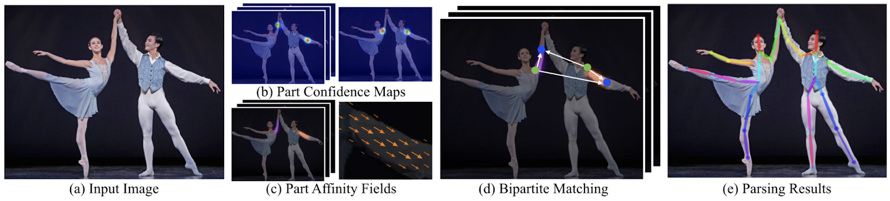
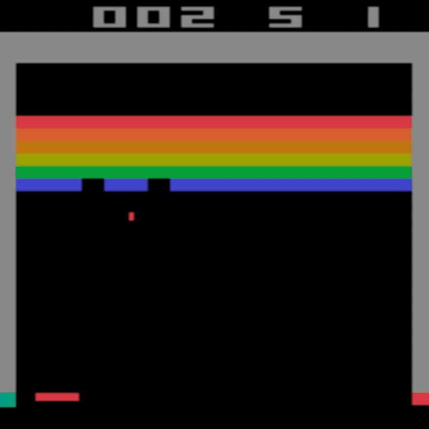
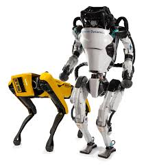

# 텐서플로우딥러닝_Deep Learning

## 1장 딥러닝의 개념과 활용

### 1. 딥러닝의 활용

- 컴퓨터 비전과 패턴 인식
- 컴퓨터 게임, 로봇 & 자율 주행
- 소리
- 미술
- Computer Hallucination, 예측 등

#### 1) 컴퓨터 비전(Computer vision)과 패턴 인식(Pattern recognition)

1. 정치인 재연하기
   - 오디오를 이용해서 비디오의 입술 움직임을 합성
2. 흑백 사진과 영상에 색 복원하기
   - 흑백 사진이나 영상을 자동으로 색이 있는 사진으로 바꿔주는 시스템
3. CSI 스타일의 픽셀 복원하기
   - 저해상 사진을 고해상도 사진으로 복원(Pixel Recursive Super Resolution)

4. 실시간으로 여러 사람의 움직임 추정하기

5. 실시간 행동 분석
   - 실시간으로 차량, 사람, 사물 등의 행동을 분석

#### 2) 컴퓨터 게임, 로봇 & 자율자동차

1. Winning Atari Breakout
   - Google의 DeepMind팀이 Deep ReinForcement Learning 테크닉으로 바둑 인공지능 프로그램을 개발
   - 2016년 3월 9일에 한국의 이세돌 9단의 대결에서 4:1로 승리
   - Google의 DeepMind팀이 Deep ReinForcement Learning 테크닉으로 컴퓨터가 Atari Game Breakout을 할 수 있도록 학습시킴

2. 자율 주행

   - Tesla의 전기 자동차가 인간의 개입없이 운전하는 것을 시뮬레이션 함

3. 로보틱스

   

#### 3) 소리, 미술

1. 음성생성

   - 딥러닝은 2016년 Google은 WaveNet을 출시하고 Baidu는 deep Speech를 출시함
   - 텍스트를 목소리로 만들어내는 연구

2. 음악 작곡

   - 음성인식과 같은 기술로 음악 작곡도 가능
   - 컴퓨터가 쇼팽의 음악 특유의 패턴과 통계정보를 바탕으로 학습하고, 기존에 없었던 새로운 작품을 생성(Fancesco MArchesani의 예시)

3. 유명화가의 작품 따라하기

   - Style transfer는 기존의 화풍을 따라하여 새로운 이미지를 만들어내는 딥러닝 기법

4. 손글씨

   - 컴퓨터에 문장을 제시하면 원하는 형태의 손글씨로 만들어 보여줌

     AlexGraves

Geoffrey Hinton's summary of findings up to today

	- 데이터 셋이 너무 작음
	- 컴퓨터가 너무 느림
	- 초기 W 설정을 잘못했음
	- 비선형성의 잘못된 타입을 썻던 것이 문제