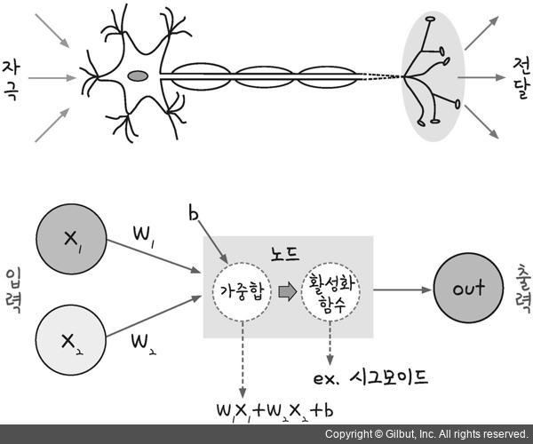
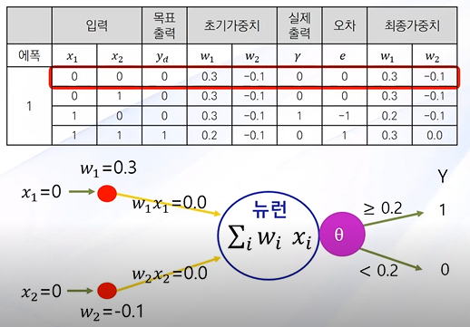

# 텐서플로우딥러닝_Deep Learning

## 2장 인공신경망(Artificial Neural Network)

- 인공신경망(Artificial Neural Network)

  "인간의 놀라운 인식력과 판단력은 단순한 기능을 가진 몇 개의 신경세포 조합에 의해 행해진다."

  => 인간의 신경세포조직을 인위로 만들 수 없을까?

  

- 인공신경망의 연구
  - 1943년 매컬럭과 피츠: 인간의 뇌를 수많은 신경세포가 연결된 하나의 디지털 네트워크 모형으로 간주하고 신경세포의 신호처리 과정을 모형화하여 단순 패턴 분류 모형을 개발
  - 헵(Hebb): 신경세포(뉴런) 사이의 연결강도(weight)를 조정하여 학습규칙을 개발
  - 로젠블럿(Rosenblatt): **퍼셉트론(Perceptron)**이라는 인공세포 개발
  - **비선형성의 한계점 발생 -XOR(Exclusive  OR)문제**
  - 폴 월보스(1974), 힌튼(1986): **역전파알고리즘(Backpropagation)**을 활용하여 비선형성을 극복한 다계층 퍼셉트론으로 새로운 인공신경망 모형 등장


- 인공신경망(Artificial Neural Network)

  - 인간 뇌를 기반으로 한 추론 모델
  - 인간 뇌의 추론 모델 - 뉴런(neuron)
  - 뉴런은 기본적인 정보처리 단위

  


- 인간 뇌의 특징
  - 100억개의 뉴런과 각 뉴런을 연결하는 6조 개의 시냅스의 결합체
  - 인간의 뇌는 현존하는 어떤 컴퓨터보다 빠르게 기능을 수행할 수 있음
  - 인간의 뇌는 매우 복잡하고, 비선형적이며, 병렬적인 정보 처리 시스템으로 생각할 수 있음
  - 정보는 신경망 전체에 동시에 저장되고 처리됨
  - 적응성에 따라 '잘못된 답'으로 이끈느 뉴런들 사이의 연결은 약화되고, '올바른 답'으로 이끄는 연결은 강화됨.


- 인간의 뇌 모델링

  - 생물학적인 뇌의 뉴런과 비슷하게 모델링 함

  - 인공신경망은 뉴런이라는 아주 단순하지만 내부적으로 매우 복잡하게 연결된 프로세스들로 이루어져 있음.

  - 뉴런은 가중치가 있는 링크들로 연결되어 있음

  - 각각의 뉴런은 연결을 통해 여러 입력 신호를 받지만 출력 신호는 오직 하나만 생성

  - 인공 신경망 구조

    


- 인공 신경망의 학습

  - 신경망은 가중치를 반복접으로 조정하여 학습
  - 뉴런은 링크(Link)로 연결되어 있고, 각 링크에는 그와 관련된 수치적인 가중치가 있음
  - 가중치는 장기 기억을 위한 기본적인 수단으로 각 뉴런 입력 강도, 즉 중요도를 표현

- 인공 신경망의 가중치 조정

  - 신경망의 가중치를 초기화하고 훈련 예제들의 집합에서 해당 가중치를 갱신

  - 신경망의 구조를 먼저 선택하고, 어떤 학습 알고리즘을 사용할 지 결정한 후, 신경망을 훈련시킴


- 뉴런의 특징
  - 입력 링크에서 여러 신호를 받아서 새로운 활성화 수준을 계산하고, 출력 링크로 출력 신호를 보냄
  - 입력 신호는 미가공 데이터 또는 다른 뉴런의 출력이 될 수 있음
  - 출력신호는 문제의 최종적인 해(solution)가 되거나 다른 뉴런에 입력될 수 있음


​														=> **퍼셉트론**

​		활성화 함수: 계산된 결과물들을 원화는 목적 형태의 값으로 변환하여 출력

- 뉴런의 계산

  - 뉴런은 전이함수, 즉 활성화 함수(activation function)을 사용

  - 활성화 함수를 이용한 출력 결정 순서

    	1. 뉴런은 입력 신호의 가중치 합을 계사하여 임계값과 비교
     	2. 가중치 합이 임계값보다 작으면 뉴런의 출력은 -1, 같거나 크면 +1을 출력함

  - 활성화 함수

    

    

- 뉴런의 출력 결정

  - 활성화 함수를 부호함수를 사용하는 뉴런의 실제출력

- 뉴런의 활성화 함수

  

  

- 단일 뉴런의 학습(단층 퍼셉트론)

  - 퍼셉트론은 선형 결합기와 하드 리미터로 구성

  - 초평면(hyperplane)으로 n차원 공간을 두 개의 결정 영역으로 나눔

  - 선형 분리 함수 

    

    

- 단일 뉴런의 학습(단층 퍼셉트론)

  - 입력이 2개일 때와 3개일 때의 퍼셉트론 도식화

  

- AND 연산자 학습(임계값 θ = 0.2, 학습률 α = 0.1)

  >AND 연산자
  >
  >입력값 두 가지가 모두 1일 때 출력값이 1이 나오는 경우

  

  

  

  => 기울기는 -1이 나와야 좋은 값 그러려면 W1 = W2

  => 절편은 1보다는 커야하고, 최적일 경우에는 2보다는 작아야 함

  => θ값은 W2보다 작아야 함

  

  > 최종가중치 = 초기가중치 + e x α 

  => 오차가 발생했을 경우, 오차를 발생시킨 요인 가중치를 변경시킴

  => 오차가 나오지 않을 때 까지, 가중치를 변경시키면서 에폭 실행


- AND와 OR 연산자 학습

  - 선형분리가 가능한 문제에서 탁월한 성능

  

  

- Exclusive OR 연산자 학습

  > 입력값이 서로 다를 때 1을 출력, 입력값이 같은 경우는 0 출력

  - 선형분리가 불가능한 경우 학습을 할 수 없음

     => 대부분 비선형의 문제들

    

- 단층 퍼셉트론 학습의 한계와 극복

  - 선형분리가 불가능하여 단층 퍼셉트론으로 학습할 수 없음


#### 1) OR data set


​		=> w1 = w2

​		=> 0 < θ/w2 <1


#### 2) TensorFlow 실습

``` python
import tensorflow as tf
import numpy as np

x_data = np.arrary([[0, 0], [0, 1], [1, 0], [1, 1]], dtype = np.float32)
y_data = np.arrary([[0], [1], [1], [1]], dtype = np.float32)

X = tf.placeholder(tf.float32)
Y = tf.placeholder(tf.float32)

W = tf.Variable(tf.random_norma([2, 1]), name = 'weight')
b = tf.Variable(tf.random_norma([1]), name = 'bias') #θ

#Hypothesis using sigmoid: tf.div(1., 1. + tf.exp(tf.matmul(X,W)))
hypothesis = tf.sigmoid(tf.matmul(X, W)- b)
#cost/loss function
cost = -tf.reduce_mean(Y * tf.log(hypothesis) + (1 - Y) * tf.log(1-hypothesis))
train = tf.train.GradienDescentOptimizer(learning_rate = 0.1).minimize(cost)

#Accuracy computation
# True if hypothesis > 0.2 else False
predicted = tf.cast(hypothesis >0.2 dtype = tf.float32)
accuracy = tf.reduce_mean(tf.cast(tf.equal(predicted, Y), dtype = tf.float32))

#Launch graph
with tf.Session() as sess:
    sess.run(tf.global_variables_initializer())
    for step in range(10001):
        sess.run(train, feed_dict={X: x_data, Y: y_data})
        if step % 500 == 0:
            print("step :",step, "\ncost :", sess.run(cost, 				  feed_dict={X: x_data, Y: y_data}), "\nWeight 					 : \n", sess.run(W), "\nbias: \n", 							  sess.run(b))
            h, c, a = sess.run([hypothesis, predicted, 						accuracy], feed_dict = {X: x_data, Y: y_data})
            print("Hypothesis:\n", h, "\nCorrect:\n", c, 
                 "\nAccuracy: ", a)
```


#### 3) Output


=> w1이랑 w2가 거의 비슷해진 것을 확인할 수 있음

=> 0<bias/w2<1이 된 것도 확인

#### 4)모형 해석


