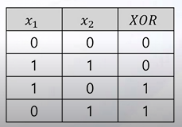
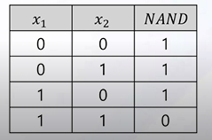
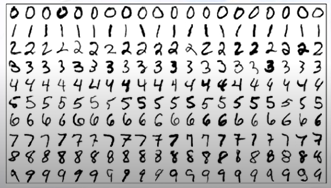
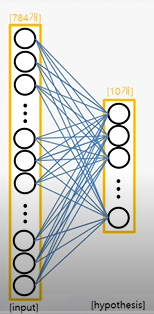
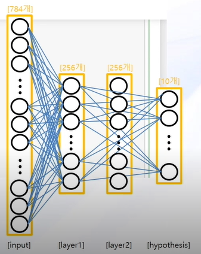
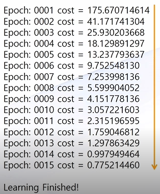

# 텐서플로우딥러닝_Deep Learning

## 신경망을 통한 XOR문제 ( neural nets for XOR)_실습테스트

### 1) XOR 실습테스트

>실습테스트 XOR

>접근풀이 및 조건
>
>- Neural Net에 대한 개념과 이해가 필요하다
>- XOR 문제의 속성과 그 내용을 파악할 수 있어야한다.

1. 제공된 데이터 (xor.txt)를 이용하여 XOR 문제에 대한 실습코드를 작성하고 그 정확도를 측정하시오



```python
#XOR 문제

import tensorflow as tf
import numpy as np

xy = np.loadtxt("xor.txt", unpack = True)
x_data = np.transpose(xy[0:-1])
y_data = np.reshape(xy[-1], (4, 1))

X = tf.placeholder(tf.float32)
Y = tf.placeholder(tf.float32)

# define 2 layer Neural Network
W1 = tf.Variable(tf.random_uniform([2,2], -1.0, 1.0))
W2 = tf.Variable(tf.random_uniform([2,1], -1.0, 1.0))

b1 = tf.Variable(tf.zeros([2]), name="Bias1")
b2 = tf.Variable(tf.zeros([1]), name="Bias2")

#Our hypothesis
L2 = tf.sigmoid(tf.matmul(X, W1)+b1)
hypothesis = tf.sigmoid(tf.matmul(L2, W2)+b2)

#Cross entropy cost function
cost = -tf.reduce_mean(Y*tf.log(hypothesis) + (1-Y)*tf.log(1-hypothesis))

#For this time, learning rate is very important
learning_rate = tf.Variable(0.1)
optimizer = tf.train.GradientDescentOptimizer(learning_rate)
train = optimizer.minimize(cost)
init = tf.global_variables_initialzer()

#Blas GEMM launch failed 오류시 아래 코드 사용
#gpu_options = tf.GPUOptions(per_process_gpu_memory_fraction=0.333)
#sess = tf.Session(config=tf.ConfigProto(gpu_option=gpu_options))

with tf.Session() as sess:
    sess.run(init)
    
    for step in range(7001):
        sess.run(train, feed_dict = {X:x_data, Y : d_data})
        if step % 500 == 0:
            print(step, sess.run(cost, feed_dict={X:x_data, 			Y:y_data}))

	#Test model
    correct = tf.equal(tf.floor(hypothesis+0.5), Y)
    #Calculate Accuracy
    accuracy = tf.reduce_mean(tf.cost(correct, 'float'))
    print(sess.run([hypothesis], feed_dict = {X:x_data, 		Y:y_data}))
    print("Accuracy:", accuracy.eval({X:x_data, Y:y_data}))
    
#결과값
0 0.69347167
500 0.6902043
...
7000 0.032477267
Accuracy : 1.0
```


### 2) NAND 실습테스트

>실습테스트  NAND

>접근풀이 및 조건
>
>- Neural Net에 대한 개념과 이해가 필요하다
>-  NAND 문제의 속성과 그 내용을 파악할 수 있어야한다.
>  - NAND == Not And

1. 제공된 데이터 (nand.txt)를 이용하여  NAND 문제에 대한 실습코드를 작성하고 그 정확도를 측정하시오



``` python
#XOR 문제

import tensorflow as tf
import numpy as np

xy = np.loadtxt("nand.txt", unpack = True)
x_data = np.transpose(xy[0:-1])
y_data = np.reshape(xy[-1], (4, 1))

X = tf.placeholder(tf.float32)
Y = tf.placeholder(tf.float32)

# define 2 layer Neural Network
W1 = tf.Variable(tf.random_uniform([2,2], -1.0, 1.0))
W2 = tf.Variable(tf.random_uniform([2,1], -1.0, 1.0))

b1 = tf.Variable(tf.zeros([2]), name="Bias1")
b2 = tf.Variable(tf.zeros([1]), name="Bias2")

#Our hypothesis
L2 = tf.sigmoid(tf.matmul(X, W1)+b1)
hypothesis = tf.sigmoid(tf.matmul(L2, W2)+b2)

#Cross entropy cost function
cost = -tf.reduce_mean(Y*tf.log(hypothesis) + (1-Y)*tf.log(1-hypothesis))

#For this time, learning rate is very important
learning_rate = tf.Variable(0.1)
optimizer = tf.train.GradientDescentOptimizer(learning_rate)
train = optimizer.minimize(cost)
init = tf.global_variables_initialzer()

#Blas GEMM launch failed 오류시 아래 코드 사용
#gpu_options = tf.GPUOptions(per_process_gpu_memory_fraction=0.333)
#sess = tf.Session(config=tf.ConfigProto(gpu_option=gpu_options))

with tf.Session() as sess:
    sess.run(init)
    
    for step in range(7001):
        sess.run(train, feed_dict = {X:x_data, Y : d_data})
        if step % 500 == 0:
            print(step, sess.run(cost, feed_dict={X:x_data, 			Y:y_data}))

	#Test model
    correct = tf.equal(tf.floor(hypothesis+0.5), Y)
    #Calculate Accuracy
    accuracy = tf.reduce_mean(tf.cost(correct, 'float'))
    print(sess.run([hypothesis], feed_dict = {X:x_data, 		Y:y_data}))
    print("Accuracy:", accuracy.eval({X:x_data, Y:y_data}))
    
#결과값
0 0.9855363
500 0.47
...
7000 0.0063362
Accuracy : 1.0
```

### 3) MNIST 실습테스트

>실습테스트  MNIST 

>접근풀이 및 조건
>
>- Neural Network에 대한 전반적인 이해와 Python Code에 대한 이해가 있어야 한다.

1. MNIST 데이터를 이용해 단층, 다층 신경망을 구축하여라. 그리고 각각 신경망에 대한 반복에 따른 cost값을 확인하고 정확도, 예측값을 출력하여라.

   

   

   1.1 단층신경망으로 실습

``` python
import tensorflow as tf
import numpy as np

#import matplotlib.pyplot as plt
from tensorflow.examples.tutorials.mnist import input_data

mnist = input_data.read_data_sets("MNIST_data/", one_hot = True)
#input 데이터를 one_hot 방식으로 받음
#check out https://www.tensorflow.org/get_started/mnist/beginners for
#more information about the mnist dataset

#parameters
learning_rate = 0.001
training_epochs = 15
batch_size = 100
#한번에 10000개 데이터를 입력받기 어렵기 때문에 batch_size를 설정해주고 15번에 거쳐 트레이닝

#input place holders
X = tf.placeholder(tf.float32, [None, 784])
Y = tf.placeholder(tf.float32, [None, 10])
#출력값을 1개가 아닌 여러개로 나올 수 있게 함

#weights & bias for nn layers
W = tf.Variable(tf.random_normal([784, 10]))
b = tf.Variable(tf.random_normal([10]))

hypothesis = tf.matmul(X, W) + b

#define cost/loss & optimizer
cost = tf.reduce_mean(tf.nn.softmax_cross_entropy_with_logits(
	   logits = hypothesis, labels = Y))
optimizer = tf.train.AdamOptimizer(learning_rate = learning_rate).minimize(cost)

#initialize
sess = tf.Session()
sess.run(tf.global_variable_initializer())

#train my model
for epoch in range(training_epochs):
    avg_cost = 0
    total_batch = int(mnist.train.num_examples / batch_size)
    
    for i in range(total_batch):
        batch_xs, batch_ys = mnist.train.next_batch(batch_size)
        feed_dict = {X: batch_xs, Y: batch_ys}
        c, _ = sess.run([cost, optimizer], feed_dict=feed_dict)
        avg_cost += c / total_batch
        
    print("Epoch:", '$04d' % (epoch +1), 'cost:', 			             '{:.9f}'.format(avg_cost))
    print("Learning Finished")
    

#Test model and check accruacy
correct_prediction  = tf.equal(tf.argmax(hypothesis, 1), 						  tf.argmax(Y, 1))
accuracy = tf.reduce_mean(tf.cast(correct_prediction, 				   tf.float32))
print("Accuracy:", sess.run(accuracy, feed_dict = 				  {X:mnist.test.images}, Y: mnist.test.labels))

#Get one and predict
r = random.randint(0, mnist.test.num_examples -1)
print("Label: ", sees.run(tf.argmax(mnist.labels[r:r+1], 1)))
print("Prediction: ", see.run(tf.argmax(hypothesis, 1), 		  feed_dict = {X: mnist.test.images[r:r+1]}))

#plt.imshow(mnist.test.images[r:r+1], reshape(28,28),
#           cmap ="Greys", interpolations = 'nearest')
#plt.show()

#결과
#Accuracy: 0.8923
#Label: [8]
#Prediction: [5]
```




- 실행결과


​	1.2 다층신경망으로 실습

``` python
import tensorflow as tf
import numpy as np
#import matplotlib.pyplot as plt

from tensorflow.examples.tutorials.mnist import input_data

tf.set_random_seed(777) #reproducibility

mnist = input_data.read_data_sets("MNIST_data/", one_hot = True)
#input 데이터를 one_hot 방식으로 받음
#check out https://www.tensorflow.org/get_started/mnist/beginners for
#more information about the mnist dataset

#parameters
learning_rate = 0.001
training_epochs = 15
batch_size = 100

#input place holders
X = tf.placeholder(tf.float32, [None, 784])
Y = tf.placeholder(tf.float32, [None, 10])
#출력값을 1개가 아닌 여러개로 나올 수 있게 함

#weights & bias for nn layers
W1 = tf.Variable(tf.random_normal([784, 256]))
b1 = tf.Variable(tf.random_normal([256]))
L1 = tf.nn.relu(tf.matmul(X, W1) + b1)

W2 = tf.Variable(tf.random_normal([256, 256]))
b2 = tf.Variable(tf.random_normal([256]))
L2 = tf.nn.relu(tf.matmul(L1, W2) + b2)

W3 = tf.Variable(tf.random_normal([256, 10]))
b3 = tf.Variable(tf.random_normal([10]))
hypothesis = tf.matmul(L2, W3) + b3

#define cost/loss & optimizer
cost = tf.reduce_mean(tf.nn.softmax_cross_entropy_with_logits(
	   logits = hypothesis, labels = Y))
optimizer = tf.train.AdamOptimizer(learning_rate = learning_rate).minimize(cost)

#initialize
sess = tf.Session()
sess.run(tf.global_variable_initializer())

#train my model
for epoch in range(training_epochs):
    avg_cost = 0
    total_batch = int(mnist.train.num_examples / batch_size)
    
    for i in range(total_batch):
        batch_xs, batch_ys = mnist.train.next_batch(batch_size)
        feed_dict = {X: batch_xs, Y: batch_ys}
        c, _ = sess.run([cost, optimizer], feed_dict=feed_dict)
        avg_cost += c / total_batch
        
    print("Epoch:", '$04d' % (epoch +1), 'cost:', 			             '{:.9f}'.format(avg_cost))
    print("Learning Finished")
    

#Test model and check accruacy
correct_prediction  = tf.equal(tf.argmax(hypothesis, 1), 						  tf.argmax(Y, 1))
accuracy = tf.reduce_mean(tf.cast(correct_prediction, 				   tf.float32))
print("Accuracy:", sess.run(accuracy, feed_dict = 				  {X:mnist.test.images}, Y: mnist.test.labels))

#Get one and predict
r = random.randint(0, mnist.test.num_examples -1)
print("Label: ", sees.run(tf.argmax(mnist.labels[r:r+1], 1)))
print("Prediction: ", see.run(tf.argmax(hypothesis, 1), 		  feed_dict = {X: mnist.test.images[r:r+1]}))

#plt.imshow(mnist.test.images[r:r+1], reshape(28,28),
#           cmap ="Greys", interpolations = 'nearest')
#plt.show()

#결과
#Accuracy: 0.9943 #성능이 훨씬 좋아짐(5%)
#Label: [6]
#Prediction: [6]
```





​							=> cost 값이 줄어드는 값이 매우 큼