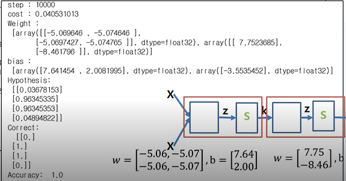
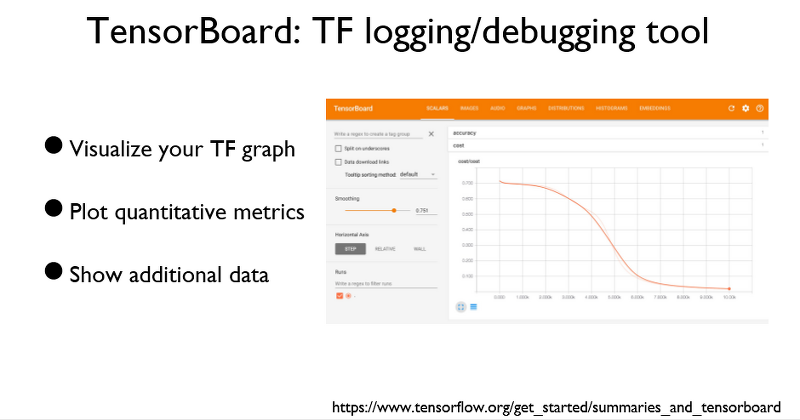
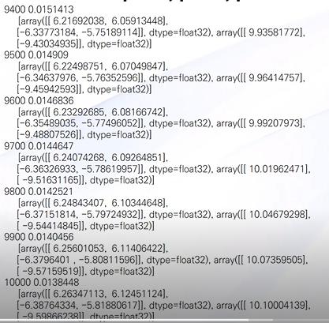
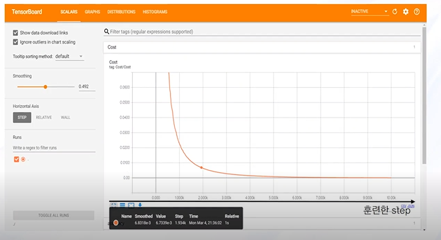
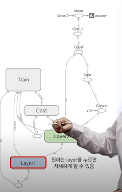
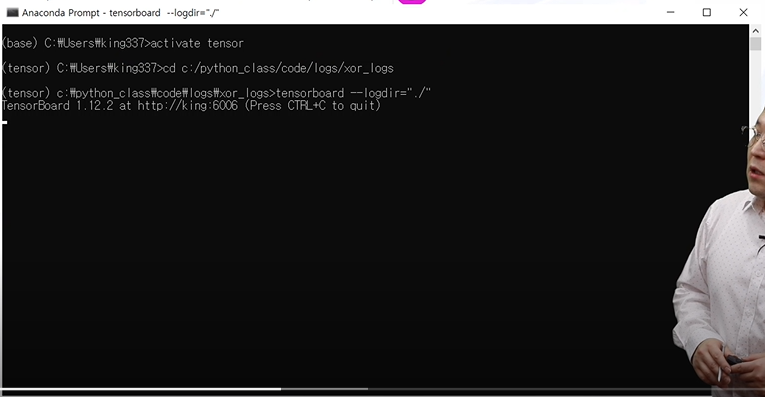
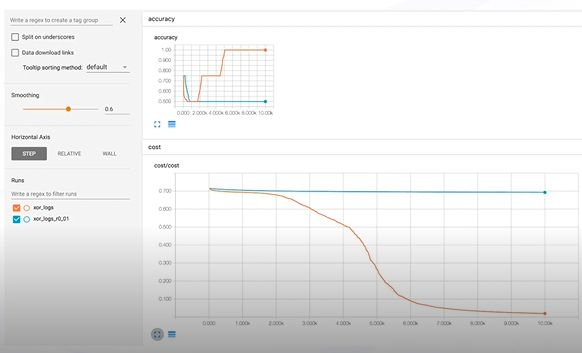
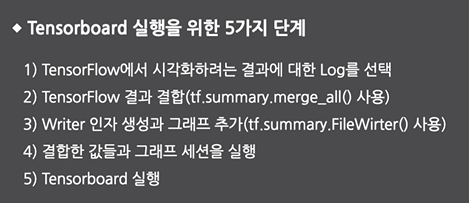

# 텐서플로우딥러닝_Deep Learning

## 신경망 이해 _ Tensorboard for nn

### 1) XOR in NN

``` python
#XOR 게이트
x_data = np.array([[0, 0], [0, 1], [1, 0], [1, 1]], dtype=np.float32)
y_data = np.array([[0], [1], [1], [0]], dtype = np.float32)

X = tf.placeholder(tf.float32)
Y = tf.placeholder(tf.float32)

W1 = tf.Variable(tf.random_normal([2, 2]), name = 'weight1')
b1 = tf.Variable(tf.random_normal([2], name = 'bias1'))
layer1 = tf.sigmoid(tf.matmul(X, W1) +b1)

W2 = tf.Variable(tf.random_normal([2, 1]), name = 'weight2')
bw = tf.Variable(tf.random_normal([2], name = 'bias2'))
hypothesis = tf.sigmoid(tf.matmul(layer1, W2) +b2)

#cost/loss function
cost = -tf.reduce_mean(Y* tf.log(hypothesis) + (1-Y)* tf.log(1-hypothesis))
train = tf.train.GradientDescentOptimizer(learning_rate = 0.1).minimize(cost)

#Accuracy computation
#True if hypothesis > 0.2 else False
predicted = tf.cast(hypothesis > 0.2, dtype = tf.float32)
accuracy = tf.reduce_mean(tf.cast(tf.equal(predicted, Y), dtype = tf.float32))

#Launch graph
with tf.Session() as sess:
    sess.run(tf.global_variables_initializer())
    for step in range(10001):
        sess.run(train, fedd_dict = {X :x_data, Y: y_data})
        if step % 500 == 0:
            print("step: \n", sess.run(cost, feed_dict = {X :x_data, Y: y_data}), "\nWeight: \n", sess.run([W1, W2]), "\nBiase: \n", sess.run([b1, b2]))
            h, c, a = sess.run([hypothesis, predicted, accuracy], feed_dict = {X :x_data, Y: y_data} )
            print("Hypothesis:\n", h, "\nCorrect: \n", c, "\nAccuracy: \n", a)

```

- 0번째

  

- 7000번째

  

- 10000번째

  

  

### 2) TensorBoard 

1. TensorBoard: TF logging/debugging tool

   


2. Old fashion : print, print, print

   

   

3. New way!

   

   2000번 정도만 학습시켜도 낮은 cost로 학습이 가능


3)**TensorBoard for XOR NN**

- 5 steps of using Tensorboard

  1. From TF graph, decide which tensors you want to log

     ```python
     w_hist = tf.summary.histogram("weights", W)
     
     cost_summ = tf.summary.scalar("cost", cost)
     ```

     => 무엇을 확인하고 싶은지를 지정

     

  2. Merge all summaries

     ``` python
     summary = tf.summary.merge_all()
     ```

     => 쌓아두고자 하는 단계

     

  3. Create writer and add graph

     ``` python
     #Create Summary Writer
     writer = tf.summary.FileWriter('./logs')
     writer.add_graph(sess.graph)
     ```

     => 저장할 위치 설정

     => 쌓아둔 것을 파일로 떨어뜨림

     

  4. Run Summary merge and add_summary(실행단계)

     ``` python
     s, _ = see.run([summary, optimizer], feed_dict = feed_dict)
     writer.add_summary(s, global_step = global_step)
     ```

     => 구조화 시킨 것을 계속 센서를 넣어 앞에서 merge한 것을 모두 돌려봄

     => 실제로 파일에 기록

     

  5. Launch TensorBoard

     ```python
     tensorboard --logdir=./logs
     ```

     => 위치에 내용들을 tensorboard로 실행(상위폴더를 실행해야 여러 버전을 한 번에 그래프로 볼 수 있음)

     

1. Scalar tensors

   ``` python
   cost_summ = tf.summary.scalar("cost", cost)
   ```

   

   

   => run이 될때마다 하나의 그래프에 저장되어 나타남


2. Histogram(multi-dimensional tensors)


### 

```python
W2 = tf.Variable(tf.random_normal([2, 1]), name = 'weight2')
b2 = tf.Variable(tf.random_normal([2], name = 'bias2'))
hypothesis = tf.sigmoid(tf.matmul(layer1, W2) +b2)

W2 = tf.Variable(tf.random_normal([2, 1]), name = 'weight2')
b2 = tf.Variable(tf.random_normal([2], name = 'bias2'))
hypothesis_hist = tf.summary.histogram("hypothesis", hypothesis)
```

​	=> 점점 큰 값으로 수렴


3. Add scope for better graph hierachy

   ``` python
   with tf.name_scope("layer1") as scope: 
       #with 함수를 쓰면 Layer1과 layer2가 한 그래프로 묶임
       W1 = tf.Variable(tf.random_normal([2,2]), name = 'weight1')
       b1 = tf.Variable(tf.random_normal([2]), name = 'b1')
       layer1 = tf.sigmoid(tf.matmul(X, W1) + b1)
       
       W1 = tf.Variable(tf.random_normal([2,2]), name = 'weight1')
       b1 = tf.Variable(tf.random_normal([2]), name = 'b1')
       layer1_hist = tf.summary.histogram("layer1", layer1)
   
   with tf.name_scope("layer2") as scope:
       W2 = tf.Variable(tf.random_normal([2, 1]), name = 'weight2')
   	b2 = tf.Variable(tf.random_normal([2], name = 'b2'))
   	hypothesis = tf.sigmoid(tf.matmul(layer1, W2) +b2)
       
       W2 = tf.Variable(tf.random_normal([2, 1]), name = 'weight2')
   	b2 = tf.Variable(tf.random_normal([2], name = 'b2'))
       hypothesis_hist = tf.summary.histogram("hypothesis", hypothesis)
   ```

   




4. Merge Summaries create writer after creating session

   ```python
   #Summary
   summary = tf.summary.merge_all()
   
   #initialize
   sess = tf.Session()
   sess.run(tf.gobal_variable_initializer())
   
   #Create summary writer
   writer = tf.summary.FileWriter(TB_SUMMARY_DIR)
   wirter.add_graph(sess.graph) #Add graph in tensorboard
   ```


5. Run merged sumary and write(and summary)

   ```python
   s, _ = see.run([summary, optimizer], feed_dict = feed_dict)
   writer.add_summary(s, global_step = global_step)
   global_step +=1
   ```

   => merge했던 값을 하나씩 돌리면서 파일에 씀


6. Launch tensorboard(local)

   ```python
   writer = tf.summary.FileWriter("./logs/xor_logs")
   ```

   => 파일 디렉토리를을 정확히 기억해야함

   ```python
   #결과창
   $ tensorboard --logdir=./logs/xor_logs
   
   Starting TensorBoard b'41' on port 6006
   (You can navigate to http://127.0.0.1:6006)
   ```

   ```python
   ssh-L local_port:
   ```

   




7. Multiple runs

   > learing_rate = 0.1 VS learning_rate = 0.01

   

   

   

   

   logs/0.1

   logs/0.01

   ==> tensorboard를 불러올 때는 logs를 불러와서 0.1과 0.01을 같이 보여줌

   



