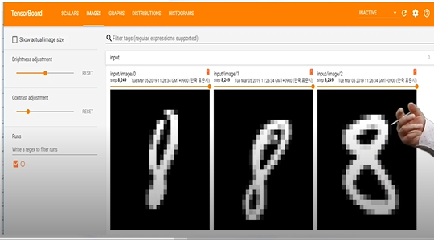
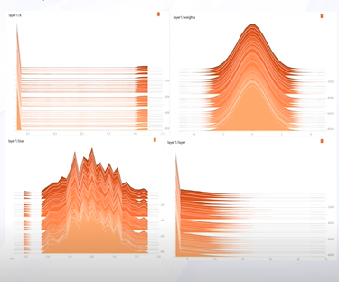
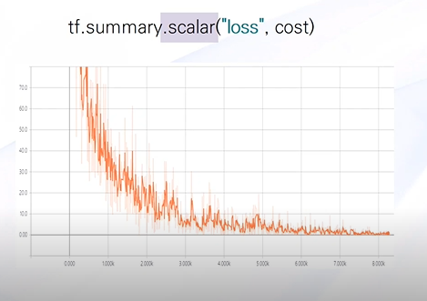
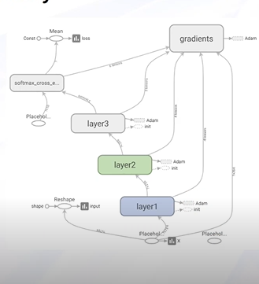

# 텐서플로우딥러닝_Deep Learning

## Visualizing your Deep learning using TensorBoard(TensorFlow)

**TensorBoard for XOR NN**

- 5 steps of using Tensorboard

  1. From TF graph, decide which tensors you want to log

     ```python
     w_hist = tf.summary.histogram("weights", W)
     
     cost_summ = tf.summary.scalar("cost", cost)
     ```

     => 무엇을 확인하고 싶은지를 지정

     

  2. Merge all summaries

     ``` python
     summary = tf.summary.merge_all()
     ```

     => 쌓아두고자 하는 단계

     

  3. Create writer and add graph

     ``` python
     #Create Summary Writer
     writer = tf.summary.FileWriter('./logs')
     writer.add_graph(sess.graph)
     ```

     => 저장할 위치 설정

     => 쌓아둔 것을 파일로 떨어뜨림

     

  4. Run Summary merge and add_summary(실행단계)

     ``` python
     s, _ = see.run([summary, optimizer], feed_dict = feed_dict)
     writer.add_summary(s, global_step = global_step)
     ```

     => 구조화 시킨 것을 계속 센서를 넣어 앞에서 merge한 것을 모두 돌려봄

     => 실제로 파일에 기록

     

  5. Launch TensorBoard

     ```python
     tensorboard --logdir=./logs
     ```

     => 위치에 내용들을 tensorboard로 실행(상위폴더를 실행해야 여러 버전을 한 번에 그래프로 볼 수 있음)

     

#### 1) Image Input

``` python
X_image = tf.reshape(X, [-1, 28, 28, 1]) #좌표
tf.summary.image('input', x_image, 3) #세개의 이미지
```




#### 2) Histogram (multi-dimensional tensors)



세로축에는 학습횟수가 들어감

1번째: X값들

2번째: weight

3번째: bias

4번째: layer => 값 수렴

``` python
with tf.variable_Scope("layer1") as scope: 
    #현재 스코프가 Layer1 안에 들어감을 지정
    W1 = tf.Variable(tf.random_normal([784, 256]))
    b1 = tf.Variable(tf.random_normal([256]))
    L1 = tf.nn.relu(tf.matmul(X, W1)+ b1)
    
    tf.summary.histogram("X", X)
    tf.summary.histogram("weights", W1)
    tf.summary.histogram("bias", b1)
    tf.summary.histogram("layer", L1)
```


#### 3) Scalar tensors

```python
tf.summary.scalar("loss", cost)
```




#### 4) Add scope for better hierarchy

```python
with tf.variable_Scope("layer1") as scope: 
    #현재 스코프가 Layer1 안에 들어감을 지정
    W1 = tf.Variable(tf.random_normal([784, 256]))
    b1 = tf.Variable(tf.random_normal([256]))
    L1 = tf.nn.relu(tf.matmul(X, W1)+ b1)
    
    tf.summary.histogram("X", X)
    tf.summary.histogram("weights", W1)
    tf.summary.histogram("bias", b1)
    tf.summary.histogram("layer", L1)
   
with tf.variable_Scope("layer2") as scope: 
   	...

with tf.variable_Scope("layer3") as scope: 
    ...
```




#### 5) Merge Summaries create writer after creating session

```python
#Summary
summary = tf.summary.merge_all()

#initialize
sess = tf.Session()
sess.run(tf.gobal_variable_initializer())

#Create summary writer
writer = tf.summary.FileWriter(TB_SUMMARY_DIR)
wirter.add_graph(sess.graph) #Add graph in tensorboard
```


#### 6) Run merged sumary and write(and summary)

```python
s, _ = see.run([summary, optimizer], feed_dict = feed_dict)
writer.add_summary(s, global_step = global_step)
global_step +=1
```


#### 7) Launch tensorboard(local)

```python
writer = tf.summary.FileWriter("c:/python/..."")
```

=> 파일 디렉토리를을 정확히 기억해야함

```python
#결과창
$ tensorboard --logdir="c:/python/..."

Starting TensorBoard b'41' on port 6006
(You can navigate to http://127.0.0.1:6006)
```


### 8) Multiple runs

``` python
tensorboard --logdiri=/tmp/mnist_logs/run1
	writer - tf.summary.FileWriter("/tmp/mnist_logs/run1")
tensorboard --logdiri=/tmp/mnist_logs/run2
	writer - tf.summary.FileWriter("/tmp/mnist_logs/run1")

tensorboard --logdir=/tmp/mnist_logs
```


2번

