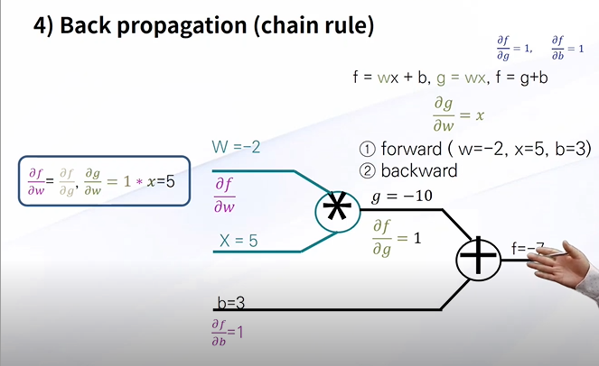
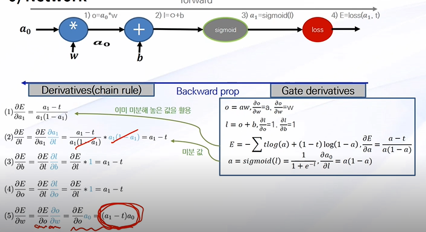
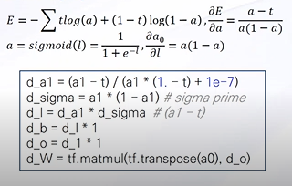

# 텐서플로우딥러닝_Deep Learning

## Tensorboard


#### 1) How to train?


#### 2) Gradient descent algorithm


​						a = learning rate

​						

#### 3) Tensorflow


``` python
train = tf.train.GradientDescentOptimizer(learning_rate = 0.1).minimize(cost)
#learning rate만 지정해주면 기울기만 계속 계산을해서 기울만큼 a를 감소시켜 계산이 가능함.
```


#### 4) Back propagation(chain rule)




최종적으로 w가 f값에 어떤 영향을 미치는 지를 알기위해서는 미분을 해서 값을 구하는 backward 방법이 필요


#### 5) Logistic Regression Network


#### 6) Network


​										a0 = 0.1, t = 0, w= 0.1, b= 0.3

​										

=> Back propagation!








#### Question


1. backpropogation은 머신러닝 알고리즘에서 (Gradient Descent)를 이용하여  parameter를 최소화 하는 것을 말한다.
2. Training data를 input한다. -> 전방향 연산(forwardpropagation)을 수행한다. -> NN의 예측값과 Target Value값의 차이인 Error를 구한다 -> Error를 NN의 각각의 Node들에 backpropagate 연산을 수행한다.
3. chain rule은 자기자신의 도함수를 가지고 있는 상태에서 이전 노드에 +1 입력값에 대해 미분값을 계산하고 사용하게 되면 중복 계산을 피할 수 있다.

