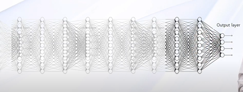
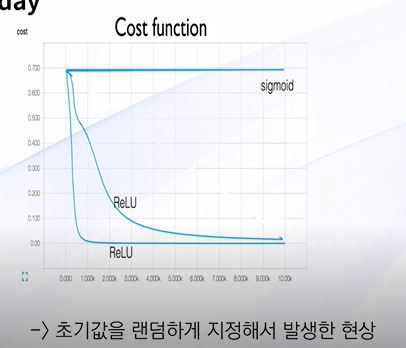
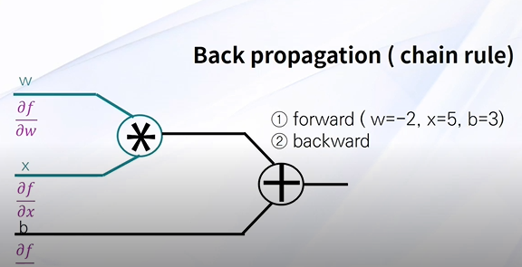
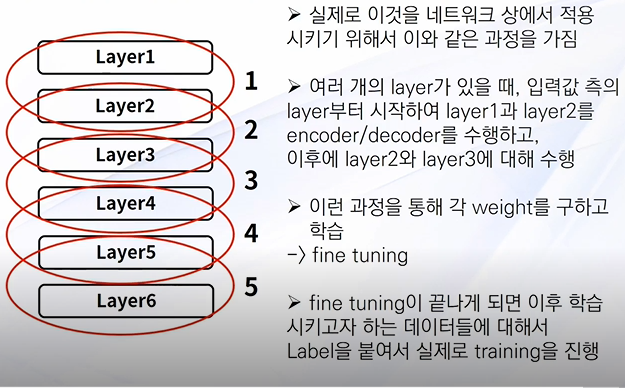

# 텐서플로우딥러닝_Deep Learning

## Tensorboard

### Weight 초기화


#### 1) vanishing gradient




​	맨 끝에 갈수록 w값을 학습하질 못함


#### 2) Geoffery Hinton's summary of findings up to today

- our labeled datasets were thousands of times too small
- our computers were millions of times too slow
- **we initialized the weights in a stupid way**
- we use the wrong type of non-linearity




​	relu가 sigmoid보다 효율젇

같은 relu여도 초기값을 랜덤하게 지정하기 때문에 그래프가 다르게 나타남


#### 3) Set all initial weights to 0

- weight의 초기값을 0으로 설정한 경우

  

  => weight을 학습할 수 없는 형태가 됨





초기값을 0으로 설정하면 계속 0이 되기 때문에 학습이 제대로 이루어지지 않음


#### 4) Need to set the initial weights values wisely

- not all 0's

- Hinton et al.(2006) "A Fast Learning Alogorithm for Deep Belief Nets"

  - Restricted Boltzmann Machine

  => '0'을 주어서는 안됨

  이에 대해 2006년 Hilton 교수가 논문을 쓰면서 RBM을 사용함으로써 해결

  이러한 RBM을 사용한 네트워크를 DBN(Deep Belief Networks)라고 함


​	입력값을 weight와 곱해서 b값을 얻어냄

​	b 유닛 아래에 있는 것들에 대해서도 같은 방법을 통해서 값을 얻음

​	이러한 과정을 Forward라고 함


backward방법으로 얻은 값들과 weight을 통해 b의 값을 얻음

처음에 입력한 값을 x라고 한다면, X와 b값의 차이가 존재 할텐데 이 차이가 최소가 될때까지 weight을 조절

이렇게 해서 weight을 구하는 것을 RBM이라고 함.(=encoder/decoder)


#### 5) How can we use RBM to initialize weights?

- apply the RBM idea on adjacent two layers as a pre-training step
- continue the first process to all layers
- This will set weights
- Example: Deep Belief Network
  - weight initialized by RBM




- pre Training이란?

  선행학습, 사전훈련, 전처리과정이라고도 함

  이는 Multi layered perceptron(MLP)에서 weight과 bias를 잘 초기화 시키는 방법이다. 이러한 pre-training을 통해서 효과적으로 layer를 쌓아서 여러 개의 hidden layer도 효율적으로 훈련할 수 있다.

  또한, 이는 unsupervised learning이 가능하기 때문에 레이블 되지 않은 큰 데이터를 넣어 훈련시킬 수 있다는 점이 장점이다.

- Fine tuning이란?

  기존에 학습되어져 있는 모델을 기반으로 architecture를 새로운 목적으로 변형하고 이미 학습된 모델 weights로 부터 학습을 업데이트 하는 방법을 말한다.

  모델의 파라미터를 미세하기 조정하는 행위(특히 딥러닝에서는 이미 존재하는 모델에 추가 데이터를 투입하여 파라미터를 업데이트 하는 것을 말한다.)


#### 6) Good News

- No need to use complicated RBM for weight initializations

- simple methods ar ok

  - Xavier initialization :  X. Glorot and Y.Bengio, "Understanding the difficulty of training deep feedforward neural networks," in international coference on aritificial intelligence and statistics, 2010
  - He's initialization: K, HE, X.Zhang, S.Ren and J.Sun 'Delving Deep into Rectifiers : Surpassing Human - Level Performance on ImageNet Classfication,' 2015

  좋은 소식은.. 2010년에 발표된 논문에서 우리가 굳이 RBM을 쓰지 않아도 좋은 초기값을 얻을 수 있다는 Xavier initialize라는 알고리즘이 나왔다.


#### 7) Xavier/ He initialization

- Makes sure the weights are 'just right', not too small not too big
- using number of input (fan-in) and output(fan-out)

```python
#Xavier initialization
#Glorot et al.2010
W = np.random.randn(fan_in, fan_out)/np.sqrt(fan_in)

#He et al.2015
W = np.random.randn(fan_in, fan_out)/np.sqrt(fan_in/2)
```

좋은 weight을 얻기 위해서 입력값의 개수 fan_in과 출력값의 개수 fan_out을 이용하여 초기값을 주는 것임. 이러한 식을 통해 RBM보다 더 좋은 결과를 가질 수 있다고 함.


